# KunSQL 使用指南

本地多引擎数据库桌面客户端，内置 **AI Copilot**：生成 / 改写 SQL、解释结果与执行计划，支持 Skills 插件与知识库。连接与凭据保存在本机。

## 1. AI Copilot（核心能力）

KunSQL 右侧 AI Copilot 面向查库场景：生成与改写 SQL、解释查询结果与执行计划，并通过 `@` 引用库表对象带上真实 Schema。支持 OpenAI 兼容 API、本地 AI CLI，以及 Skills / 知识库。

### 1.1 配置 AI

1. 打开「设置」→「AI 助手」。
2. 选择「OpenAI 兼容 API」或「本地 AI CLI」，配置模型列表与密钥 / 本地命令。
3. 按需启用「Skills 插件」「知识库」，把常用规范、表说明、排查手册沉淀进去。

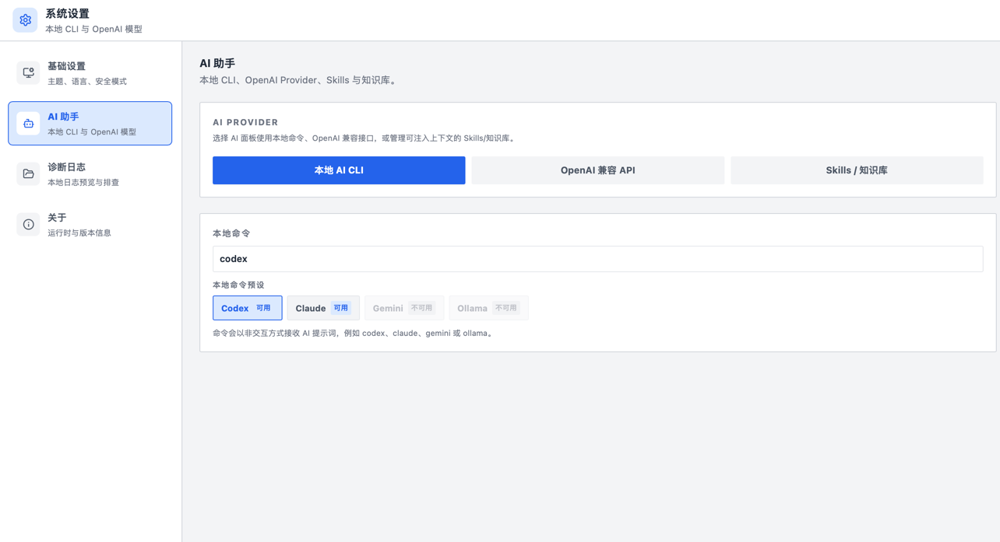
<!-- TODO: 截图 — 设置 → AI 助手（API / 本地 CLI、Skills、知识库入口） -->

### 1.2 使用 Copilot

1. 回到「数据库连接」视图，点击「展开 AI Copilot」。
2. 先连接目标库，在对话里 `@` 表 / 对象，再提问：例如「按用户统计近 7 天订单」「解释这条慢查询」。
3. 也可先点工具栏「执行计划」，把计划内容交给 Copilot 解读优化建议。

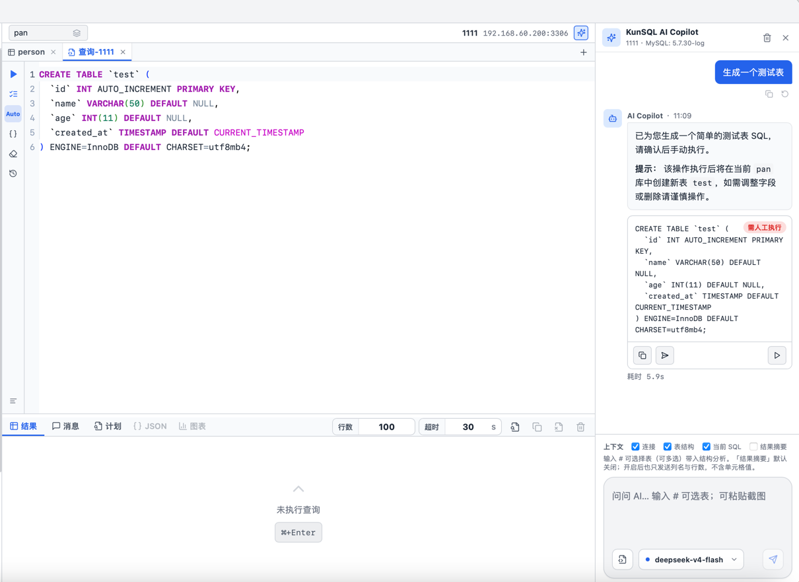
<!-- TODO: 截图 — 主界面右侧 AI Copilot 展开，含 @ 引用与一条生成 SQL 的对话 -->

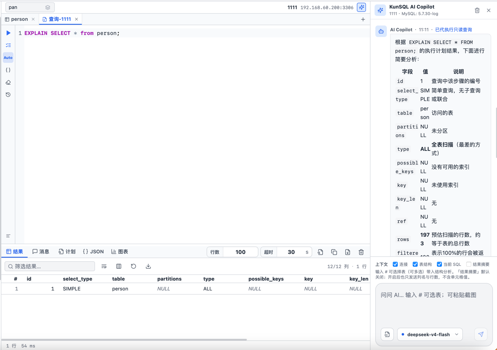
<!-- TODO: 截图 — 结果区「计划」页 + Copilot 解读（或并排） -->

> **提示**：生产库建议打开连接「只读」或「全局只读模式」，再让 AI 生成语句，避免误写。

## 2. 安装与界面

1. 从下载中心安装对应系统的 KunSQL。
2. 左侧活动栏：**数据库连接**、**数据库图表分析**、**设置**。
3. 「数据库连接」主视图：左连接树、中编辑器与结果、右 AI Copilot。

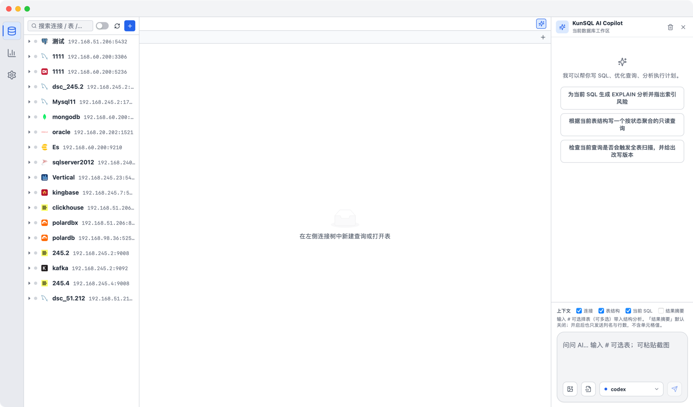
<!-- TODO: 截图 — 数据库连接主视图（左树 / 中编辑器 / 右 Copilot） -->

> **提示**：连接与密码本机加密存储，不经过云端。请在桌面应用中使用完整连库与导出能力。

## 3. 新建连接（三步向导）

1. 连接面板标题栏点「+」→「新建连接」。
2. **第一步「选择类型」**：从关系型 / 非关系型 / 大数据 / 文件等分组中选引擎（如 PostgreSQL、MySQL、SQLite、MongoDB、Redis、ClickHouse 等）。
3. **第二步「基础信息」**：填写「连接名称」「主机」「端口」「数据库」「用户名」「密码」；可设「分组」「颜色」，并开关「只读」。SQLite 则填写「数据库文件路径」。
4. **第三步「高级参数」**：按需设置「SSL 模式」与自定义参数键值。
5. 点击「测试连接」，成功会显示版本与延迟，例如「连接成功：… · xxms」。
6. 点击「保存」完成创建。

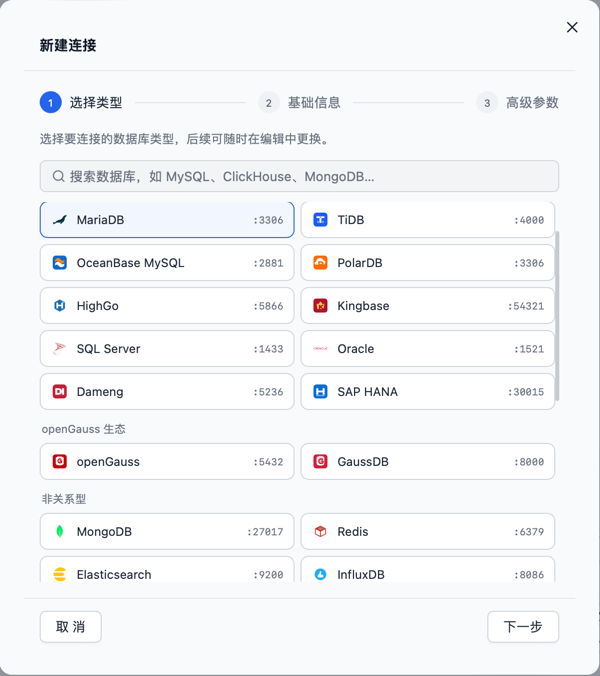
<!-- TODO: 截图 — 新建连接第一步「选择类型」引擎列表 -->

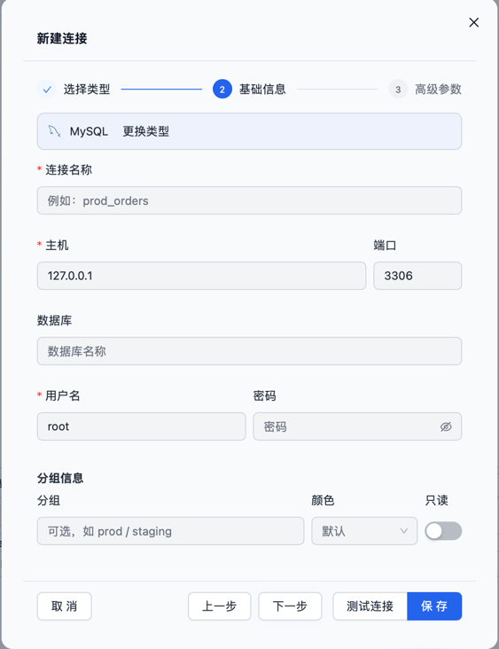
<!-- TODO: 截图 — 第二步基础信息（含只读开关） -->

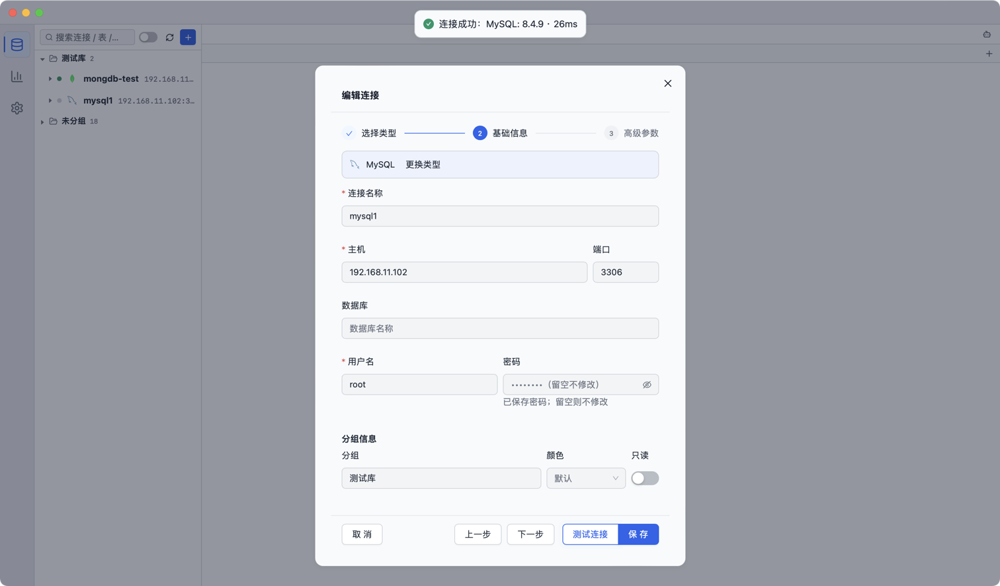
<!-- TODO: 截图 — 「测试连接」成功提示（版本 + 延迟） -->

> **提示**：编辑已有连接时，密码留空表示「不修改原密码」。

## 4. 连接与浏览对象

1. 在连接树中右键连接 →「连接」（展开节点时也会自动尝试连接）。
2. 状态会经历「正在连接…」再到「已连接 · 版本信息」。
3. 展开库 / Schema，查看表、集合、索引、键等；可用「系统对象」开关显示系统库。
4. 右键连接可：「新建查询」「刷新元数据」「编辑连接」「断开连接」「删除连接」。
5. 右键表 / 对象可：「查询数据」「查看结构」「生成 COUNT / INSERT / DDL」「在编辑器中打开」等。

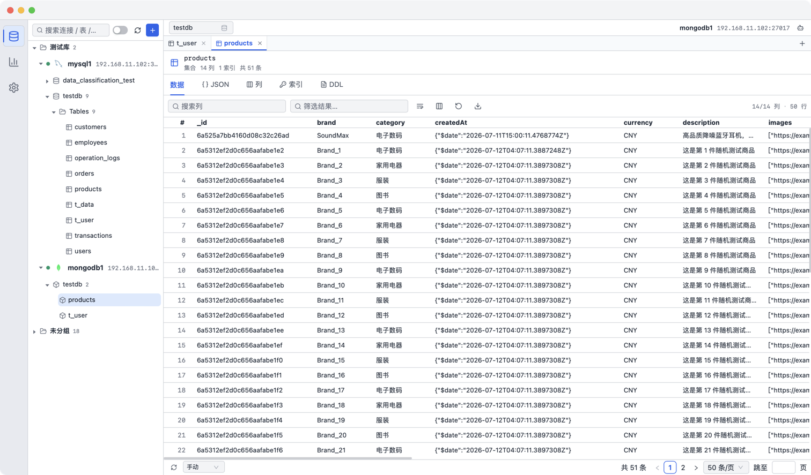
<!-- TODO: 截图 — 左侧连接树展开到表一级，状态为已连接 -->

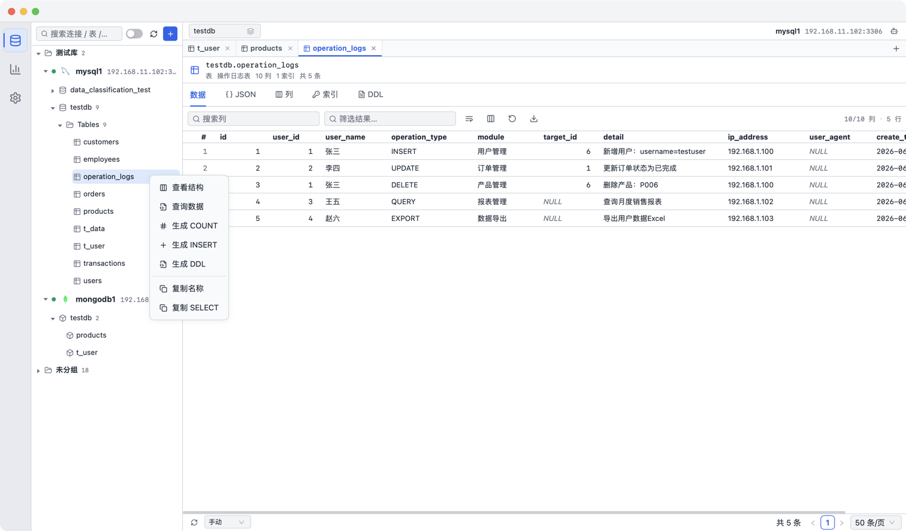
<!-- TODO: 截图 — 表对象右键菜单（查询数据 / 查看结构等） -->

## 5. 执行查询

1. 通过「新建查询」或对象右键打开编辑器标签。
2. 编写 SQL，或 MongoDB / Elasticsearch / Redis 等对应语句。
3. 工具栏：「运行」（Ctrl/⌘+Enter）、「运行全部」（Ctrl/⌘+Shift+Enter）、「执行计划」「格式化 SQL」「历史」「清空编辑器」。
4. 下方结果区可切换：「结果」「消息」「计划」「JSON」「图表」；可调「行数」限制、「超时」，并可「停止查询」。

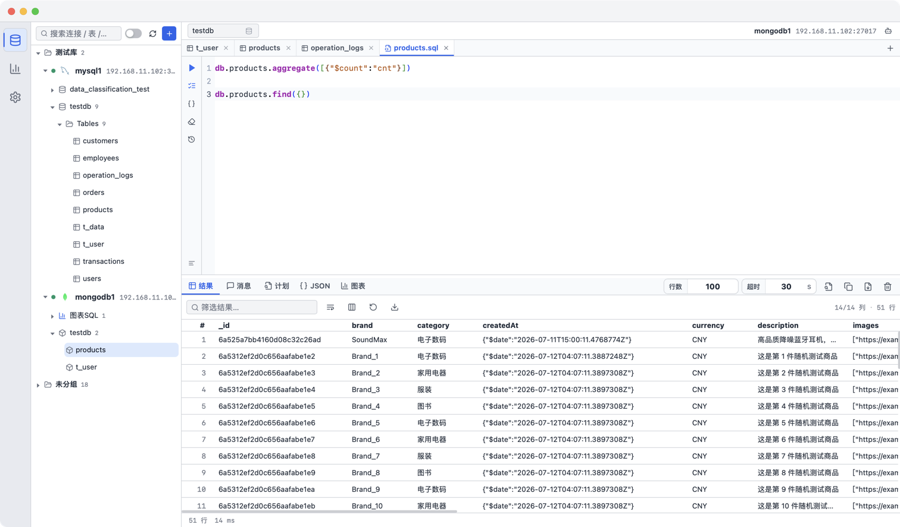
<!-- TODO: 截图 — 编辑器中有一条 SQL，下方结果表有数据 -->

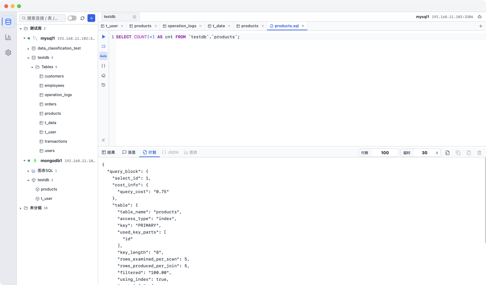
<!-- TODO: 截图 — 结果区切到「计划」页 -->

## 6. 导出结果

- **导出当前结果**：CSV / TSV / JSON / SQL（INSERT，会询问表名）
- **导出完整查询**：CSV / TSV / JSON（服务端重跑完整查询后保存）
- 导出过程中显示「导出中…」，可「取消」

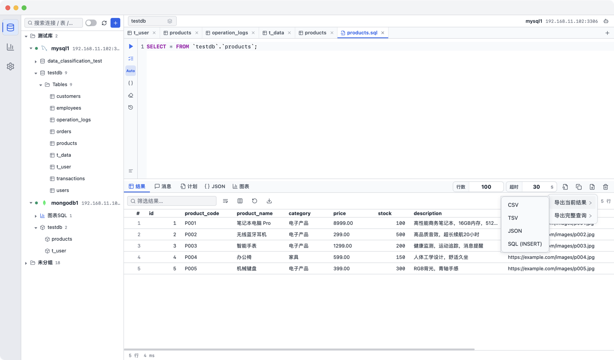
<!-- TODO: 截图 — 结果区「导出」下拉菜单 -->

## 7. 只读与安全

- **连接级**：新建 / 编辑连接第二步中的「只读」开关
- **全局**：设置 →「基础设置」→「全局只读模式」（开启后所有连接默认禁止写操作）
- 密码与 AI Key 均本机加密存储
- 生产库建议：数据库只读账号 + 客户端只读开关一起用

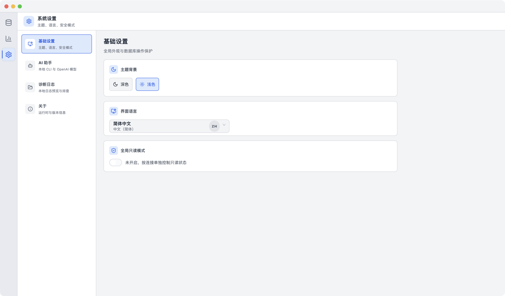
<!-- TODO: 截图 — 设置 → 基础设置中的「全局只读模式」 -->

## 8. 图表分析（可选）

「数据库图表分析」可将保存的图表 SQL 做成分析页画布，适合固定看板类查询。空状态页会有引导步骤。

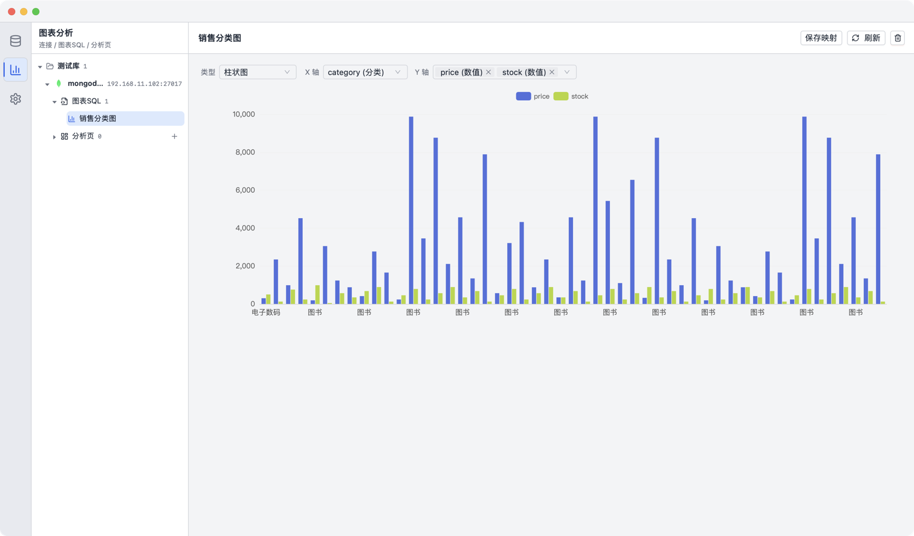
<!-- TODO: 截图 — 数据库图表分析工作区（有或无示例图表均可） -->

## 9. 常见问题

| 现象 | 处理 |
|------|------|
| Copilot 答非所问 | 先连接库并 `@` 相关表，或把表说明写入知识库 |
| 连不上 | 核对引擎、端口、防火墙、账号；云数据库需放行本机出口 IP |
| 只能内网访问 | 先用 KunTunet 映射数据库端口，再在 KunSQL 填跳板主机与端口 |
| 结果太大 | 加 `LIMIT` / 过滤条件，或使用「导出完整查询」并控制条件 |
| 写操作被拒 | 检查连接「只读」或「全局只读模式」是否开启 |
