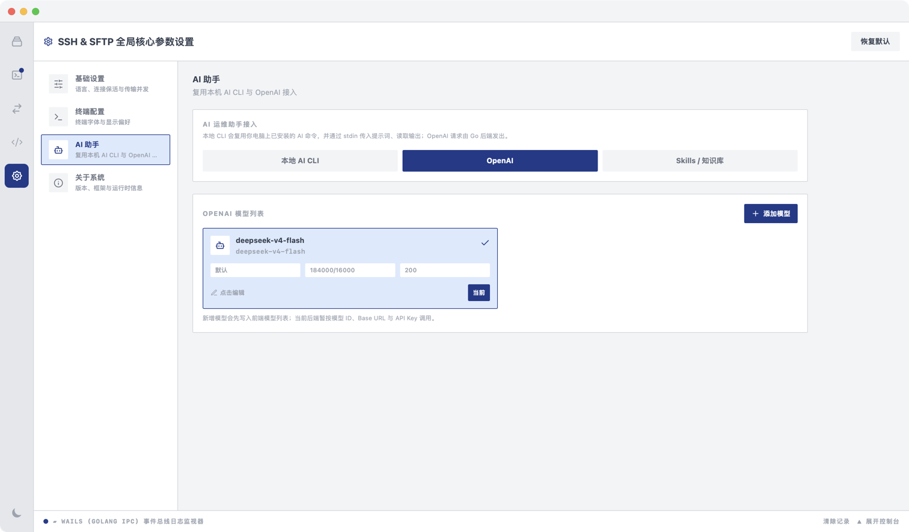
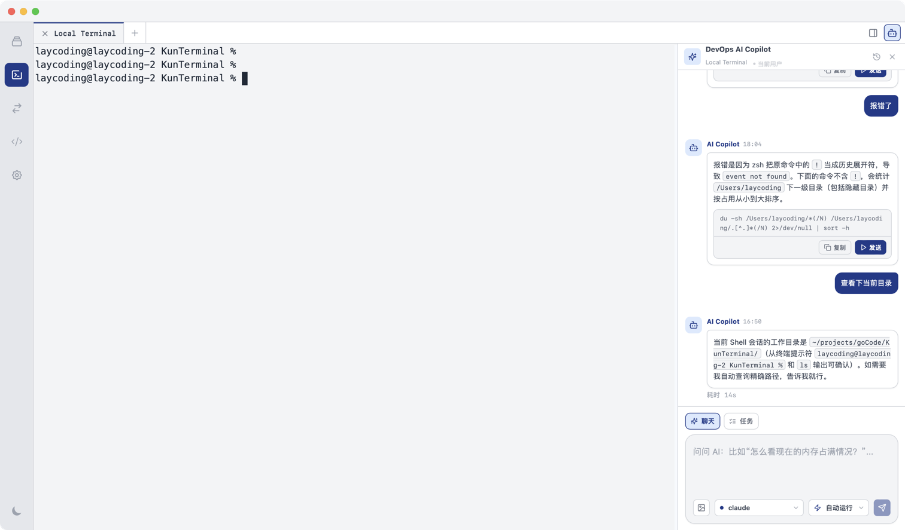
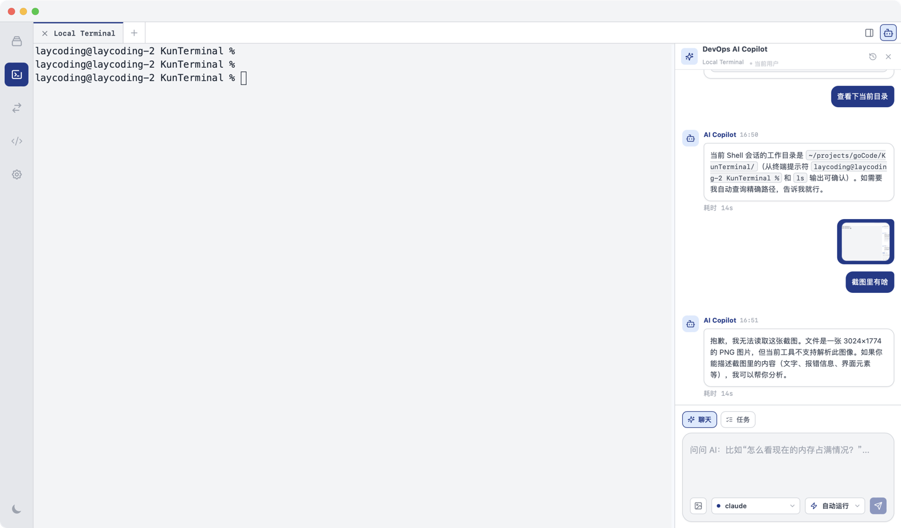
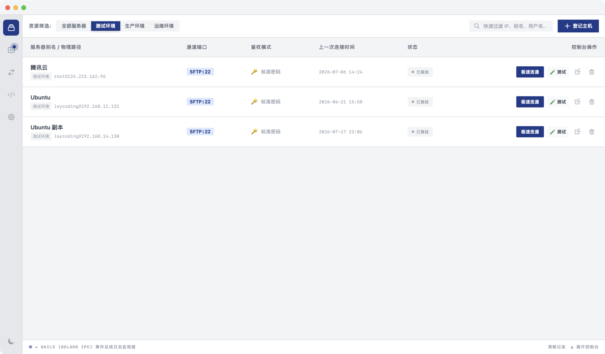
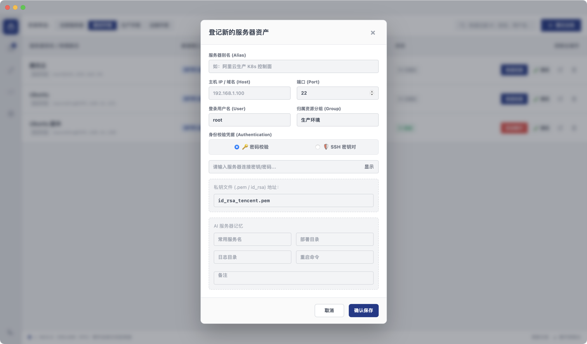
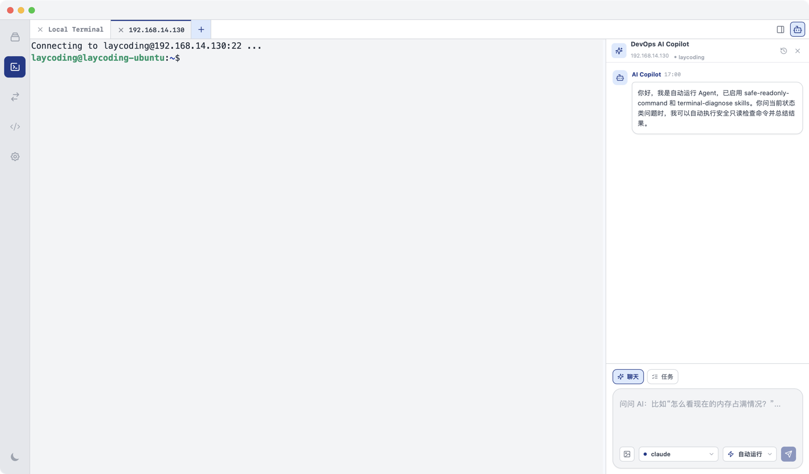
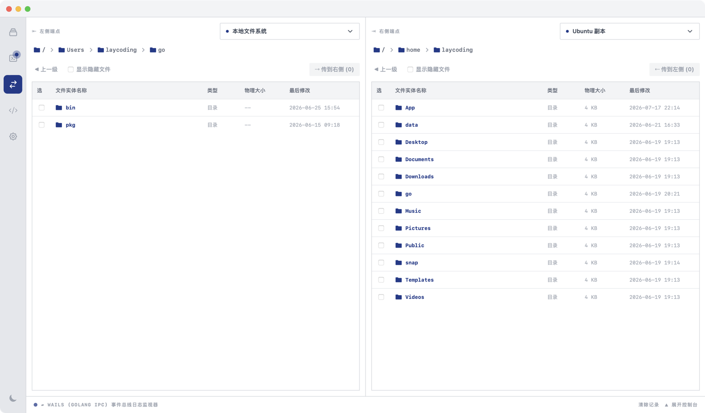
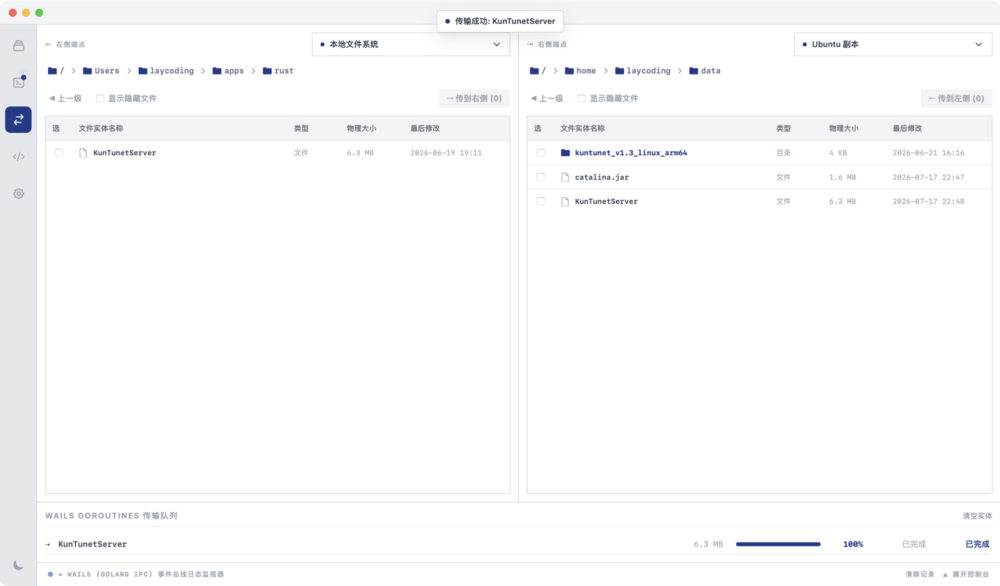
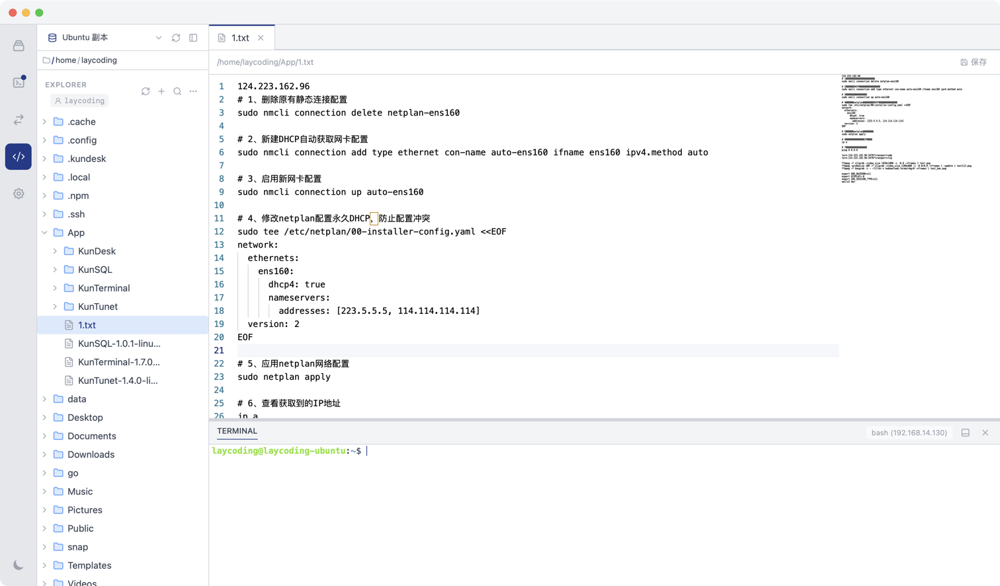
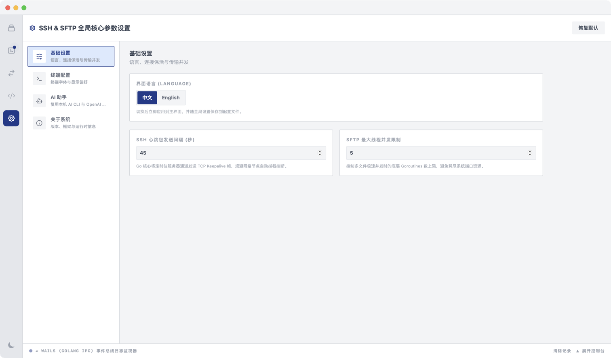

# KunTerminal 使用指南

跨平台 SSH / SFTP 桌面终端，内置 **AI Copilot**：结合会话与文件上下文排障，支持 Skills 与多模态图片提问。

## 1. AI Copilot（核心能力）

KunTerminal 内置 AI Copilot：可结合当前终端输出、远程文件与截图，解释报错、生成排查命令，并以 **AI Task** 推进运维步骤。支持「OpenAI 兼容 API」与「本地 AI CLI」。

### 1.1 配置 AI

1. 打开「系统设置」→「AI 助手」。
2. 选择「OpenAI」：填写 Base URL / 模型 / API Key；或「本地 AI CLI」：填写本机命令。
3. 点「持久化保存」。

<!-- TODO: 截图 — 系统设置 → AI 助手（OpenAI / 本地 CLI 配置界面） -->

### 1.2 使用 Copilot

1. 先「极速连通」一台主机，进入「SSH 终端」。
2. 在终端工具栏打开 **AI Copilot** 面板。
3. 对着当前会话提问，例如「这条报错怎么排」「给出重启服务并检查日志的命令」。
4. 需要看图时：附带截图 / 日志画面（多模态，视模型是否支持）。
5. 从「IDE」把远程配置文件发给 AI，分析风险点与依赖。
6. Skills 会按问题自动推荐；可在设置中管理 Skills。

<!-- TODO: 截图 — SSH 终端旁 AI Copilot 对话面板（含一条示例问答） -->

<!-- TODO: 截图 — Copilot 输入区附带图片 / 截图的状态 -->

> **提示**：涉及 sudo / 交互确认的命令，AI 不会静默代跑，会提示你在终端手动执行后再继续任务。

## 2. 安装与首次打开

1. 从下载中心安装对应系统的 KunTerminal。
2. 左侧导航：**连接管理**、**SSH 终端**、**SFTP 文件传输**、**IDE**、**系统设置**。
3. 首次进入「SSH 终端」通常已有「本地终端」标签，属正常现象。

<!-- TODO: 截图 — 左侧导航栏完整菜单 -->

> **提示**：请在桌面应用中连接服务器。若仅在浏览器预览界面操作，会出现「当前为浏览器预览模式」提示，无法真实 SSH / SFTP。

## 3. 登记主机

1. 「连接管理」→「登记主机」。
2. 填写「服务器别名」「主机 IP / 域名」「端口」（默认 22）、「登录用户名」，可选「归属资源分组」。
3. 「身份校验凭据」选「密码校验」或「SSH 密钥对」。
4. 密码方式：输入连接密码；密钥方式：填写或拖入私钥文件（`.pem` / `id_rsa`）路径。
5. 「确认保存」，成功后提示「服务器添加成功」。

<!-- TODO: 截图 — 「登记新的服务器资产」弹窗填好别名/主机/密钥后的样子 -->

<!-- TODO: 截图 — 连接管理列表中已有若干主机 -->

## 4. 连接与多标签终端

1. 在列表中点「极速连通」（或先「测试」验证 TCP 与鉴权）。
2. 进入「SSH 终端」远程标签（形如 `username@host`），即可输入命令；工具栏可开 Commands 与 AI Copilot。
3. 标签栏「+」可开「本地终端」或再连其他主机。
4. 在标签上右键可：新建窗口、复制窗口、关闭左边 / 右边 / 全部。
5. 断开：回到「连接管理」点「安全断开」。
6. 若会话断开，终端内提示「按 Enter 重新连接」。

<!-- TODO: 截图 — 多标签 SSH 终端（至少一个远程会话 + 本地终端） -->

> **警告**：若弹出「服务器主机密钥已变更」，确认环境无误后可选「删除旧记录并重连」。

<!-- TODO: 截图 — 「服务器主机密钥已变更」提示对话框（如有） -->

## 5. SFTP 文件传输

1. 先确保已有活跃远程连接，再打开「SFTP 文件传输」。
2. 「左侧端点」「右侧端点」可分别选「本地文件系统」或已保存的远程服务器。
3. 用面包屑、进入、上一级、搜索浏览目录；可显示隐藏文件。
4. 在两侧之间拖拽，或使用「传到右侧」「传到左侧」传输文件。
5. 右键可新建目录、重命名、删除、刷新列表。
6. 底部「传输队列」可查看进度，支持取消、重试、清空。

<!-- TODO: 截图 — SFTP 左右双栏（一侧本地、一侧远程） -->

<!-- TODO: 截图 — 底部传输队列有进行中或已完成任务 -->

> **提示**：未连接远程时进入 SFTP，会提示「无活跃连接，请先连接一台远程服务器」。

## 6. IDE（可选）

「IDE」需要先有活跃远程连接。左侧为远程文件树，中间为编辑器，底部为嵌入终端，适合改远程配置文件并立刻在终端验证；也可把文件发给 AI 分析。

<!-- TODO: 截图 — IDE：文件树 + 编辑器 + 底部终端 -->

## 7. 其他系统设置

- **基础设置**：界面语言、SSH 心跳包发送间隔、SFTP 最大线程并发限制
- **终端配置**：终端字体大小、字型系列
- **关于系统**：版本信息；底部可「恢复默认」「持久化保存」

<!-- TODO: 截图 — 系统设置 → 基础设置 / 终端配置 -->

## 8. 常见问题

| 现象 | 处理 |
|------|------|
| Copilot 无响应 | 检查 AI 模式、密钥 / 本地命令是否已「持久化保存」 |
| 连接超时 | 检查 Host / 端口、本机网络、目标 sshd 与安全组 |
| 密钥失败 | 核对私钥格式与权限、用户名是否匹配 |
| 只能内网访问 | 先用 KunTunet 映射 22，再填公网 IP 与映射端口 |
| SFTP 打不开 | 先在连接管理里「极速连通」建立会话 |
