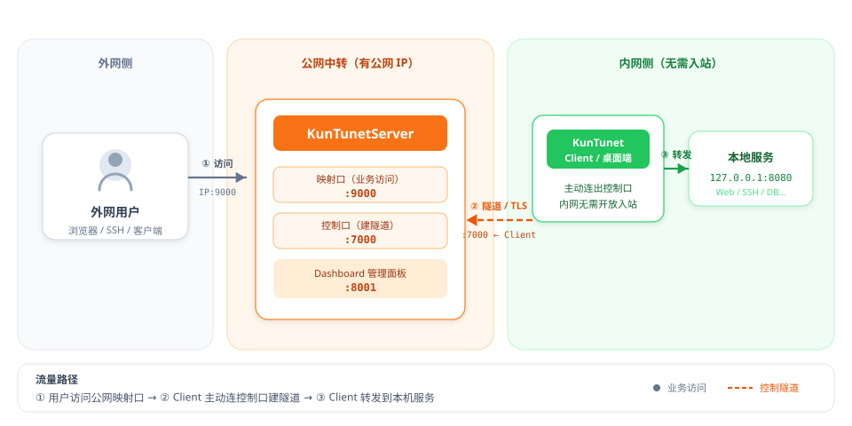
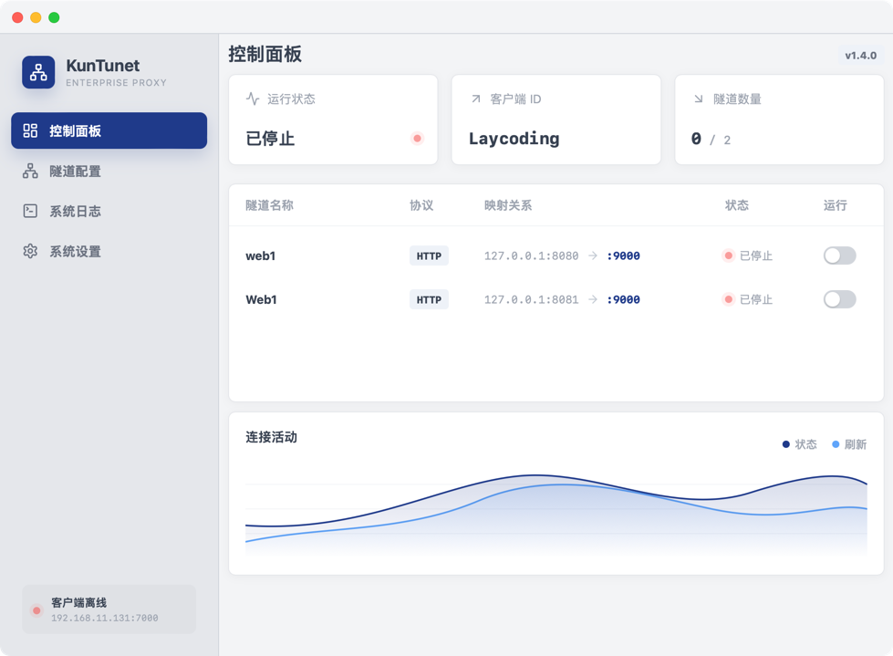
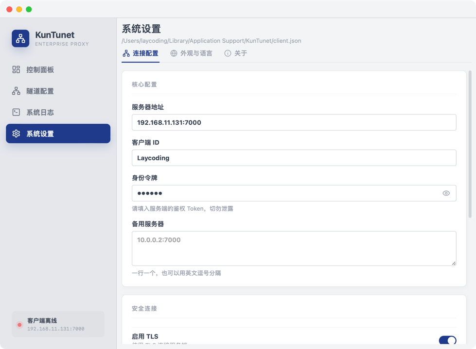
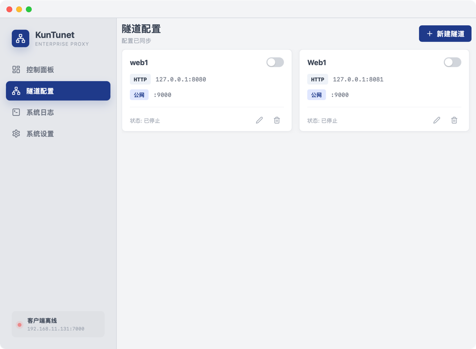
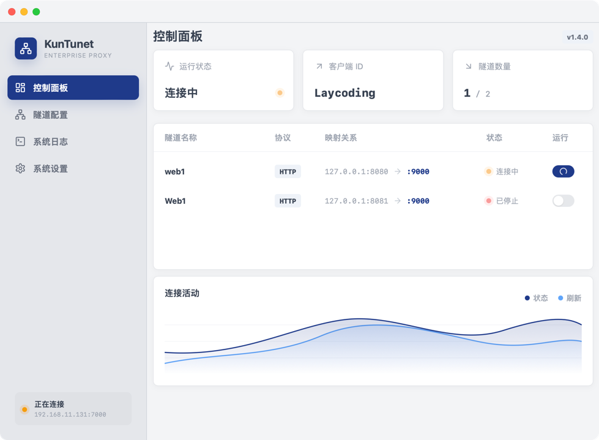

# KunTunet 使用与部署

把内网 TCP 服务（Web、SSH、数据库等）安全映射到公网：部署服务端 → 配置客户端 / 桌面端 → 验证连通。

## 1. 这是做什么的

KunTunet 通过一台有公网 IP 的中转服务器，把内网机器上的服务暴露到公网端口。外网访问「公网 IP:映射端口」时，流量经隧道转发到内网本地服务。



**读图说明：**

| 区域 | 角色 | 关键端口（示例） |
|------|------|------------------|
| 外网侧 | 用户浏览器 / SSH / 客户端 | 访问公网 `IP:9000` |
| 公网中转 | `KunTunetServer` | 映射口 `:9000`、控制口 `:7000`、Dashboard `:8001` |
| 内网侧 | `KunTunetClient` 或桌面端 | 主动连出到 `:7000`，再转发到 `127.0.0.1:8080` 等本地服务 |

要点（与图中 ①②③ 对应）：

1. **① 业务访问**：用户打公网映射口；**② 控制隧道**：Client **主动连出**到 Server 控制口（内网无需对公网开放入站）。
2. **映射口**对外提供业务；**控制口**只给 Client 建隧道（建议 Token / TLS）；**③** Client 再转发到本机服务。
3. Dashboard（`:8001`）查看在线 Agent、隧道与流量，一般只对本机或管理网开放。

## 2. 开始前准备

- 一台有公网 IP 的服务器：安装 **KunTunetServer**
- 一台内网机器：安装 **KunTunetClient**，或安装 **KunTunet 桌面客户端**
- 防火墙放行：控制端口（如 `7000`）以及每一个映射端口（如 `9000`）
- 服务端与客户端使用相同 Token（正式环境建议 Token 文件 + TLS）

> **提示**：下载中心里的「服务端包」含 Server / Client / Admin；桌面 GUI 是单独安装包。

## 3. 部署服务端（公网机器）

1. 从下载中心获取对应系统的服务端包，解压得到 `KunTunetServer`。
2. 先用测试方式启动（静态 Token + 管理面板），见下方命令。
3. 浏览器打开 `http://服务器IP:8001`，可看到在线 Agent、隧道与流量（约 3 秒刷新）。
4. 正式环境请改用 TLS + Token 文件启动。
5. Linux 可用发布包内脚本安装为系统服务：编辑配置后执行 `install-server-service.sh`，再用 `systemctl` 启停。

### 测试启动

```bash
KunTunetServer -control 0.0.0.0:7000 -token YOUR_SECRET_TOKEN -mgmt 127.0.0.1:8001
```

### 正式启动（TLS + Token 文件）

```bash
KunTunetServer \
  -control 0.0.0.0:7000 \
  -mgmt 127.0.0.1:8001 \
  -token-file /etc/kuntunet/tokens.json \
  -tls-cert /etc/kuntunet/server.crt \
  -tls-key /etc/kuntunet/server.key
```

### 常用参数

| 参数 | 说明 |
|------|------|
| `-control` | 客户端连上来的控制地址，公网一般用 `0.0.0.0:7000` |
| `-mgmt` | Dashboard / 管理 API，如 `127.0.0.1:8001` |
| `-token` | 与客户端共享的认证口令 |
| `-token-file` | 多 Agent Token、过期与撤销（正式环境推荐） |
| `-tls-cert` / `-tls-key` | 启用 TLS |


<!-- TODO: 截图 — 浏览器打开管理面板 :8001，展示在线 Agent / 隧道列表 -->

## 4. 部署命令行客户端（内网机器）

假设内网 Web 在 `127.0.0.1:8080`，要映射到公网 `9000` 端口：

```bash
KunTunetClient \
  -server PUBLIC_IP:7000 \
  -token YOUR_SECRET_TOKEN \
  -name web \
  -remote 0.0.0.0:9000 \
  -local 127.0.0.1:8080
```

启用 TLS 时追加：`-tls -tls-ca ca.crt`。也可用配置文件：`KunTunetClient -config client.json`。

| 参数 | 说明 |
|------|------|
| `-server` | 公网服务端控制地址 |
| `-token` | 必须与服务端一致 |
| `-name` | 隧道名称，同一 Server 内勿重复 |
| `-remote` | 服务端上监听的映射地址，公网访问用 `0.0.0.0:端口` |
| `-local` | 内网真实服务地址 |

> **警告**：远程地址写成 `127.0.0.1:9000` 时，映射口只在服务器本机可访问，外网连不上。公网暴露请用 `0.0.0.0:端口`。

辅助命令：

- 启动前校验：`KunTunetClient check -config client.json`
- 运行中状态：`KunTunetClient status`
- 停止：前台运行按 `Ctrl+C`；若装成服务则用系统服务停止

## 5. 使用桌面客户端

安装 KunTunet 桌面端后，左侧有四个入口：**控制面板**、**隧道配置**、**系统日志**、**系统设置**。


<!-- TODO: 截图 — 桌面端打开后的控制面板总览 -->

### 5.1 系统设置

1. 打开「系统设置」→「核心配置」：填写「服务器地址」（如 `公网IP:7000`）、「客户端 ID」、「身份令牌」；需要时填写「备用服务器」。
2. 「安全连接」：按需开启「启用 TLS」，填写「CA 文件」「Server Name」；排障时可临时「跳过证书校验」。
3. 「连接策略」：可调心跳间隔、连接超时、重连最小 / 最大间隔。


<!-- TODO: 截图 — 「系统设置」核心配置 + 安全连接区域 -->

### 5.2 新建并运行隧道

1. 打开「隧道配置」→「新建隧道」。
2. 填写「隧道名称」「本地地址」（如 `127.0.0.1:8080`）、「远程地址」（如 `0.0.0.0:9000`），可选「隧道组 ID」→「保存」。
3. 在「控制面板」或「隧道配置」中打开该隧道的「运行」开关启动；再拨一次即可停止。
4. 「控制面板」可看运行状态、隧道数量（运行中 / 总数）；「系统日志」查看实时日志。


<!-- TODO: 截图 — 「新建隧道」弹窗字段填好后的样子 -->


<!-- TODO: 截图 — 隧道列表中「运行」开关打开、状态为已连接 -->

> **提示**：有隧道正在运行时，「系统设置」会被锁定；改服务器地址或 Token 前请先停止隧道。配置会在启动隧道时写入本机。

## 6. 验证与排障

1. 内网先确认本地服务：`curl http://127.0.0.1:8080`
2. 外网访问映射：`curl http://PUBLIC_IP:9000`（非 HTTP 可用 `nc -vz PUBLIC_IP 9000`）
3. 打开 Dashboard `http://PUBLIC_IP:8001`，确认 Agent 在线、隧道存在

常见问题：

- **Agent 不在线**：核对 Token、控制端口防火墙、TLS 证书与 CA
- **映射不通**：确认映射端口已放行，`-remote` 为 `0.0.0.0`，`-local` 指向正确进程
- **桌面端改不了设置**：先停止所有运行中的隧道

## 7. 与其他产品联动

- **SSH**：`-local 127.0.0.1:22`，映射到公网端口后，用 KunTerminal 连接 `公网IP:映射端口`，并用 AI Copilot 排障
- **数据库**：映射 `5432` / `3306` 等后，KunSQL 主机填公网 IP、端口填映射端口，再用 AI Copilot 写 SQL
