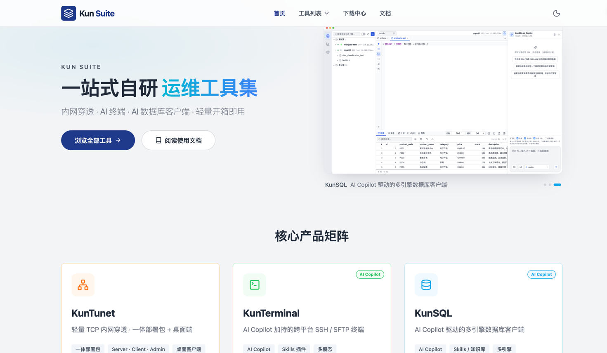

# Kun Suite 文档总览

欢迎使用 Kun Suite 使用说明。本站文档面向最终用户，覆盖安装、部署与日常操作（不含开发打包）。

<!-- TODO: 截图 — 官网首页第一屏（品牌 + 三个产品卡片） -->

## 套件组成

Kun Suite 当前包含三款独立工具，可单独使用，也可组合：

| 产品 | 一句话 |
|------|--------|
| **KunTunet** | 内网穿透：公网部署 Server，内网跑 Client / 桌面端，把 TCP 服务映射到公网端口 |
| **KunTerminal** | AI Copilot 加持的跨平台 SSH / SFTP 终端，支持 Skills 与多模态排障 |
| **KunSQL** | AI Copilot 驱动的多引擎数据库客户端，写 SQL、读执行计划、Skills / 知识库 |

<!-- TODO: 截图 — 首页「核心产品矩阵」三张卡片（含 AI Copilot 角标） -->

## 典型组合场景

1. **映射 SSH**：KunTunet 将内网 `22` 端口映射到公网 → 用 KunTerminal 连接跳板地址 → 打开 AI Copilot 排障。
2. **映射数据库**：KunTunet 映射 `5432` / `3306` 等 → 用 KunSQL 填写跳板主机与端口连库 → AI Copilot 写 SQL / 读计划。
3. **映射 Web / 其他 TCP**：KunTunet 映射对应端口后，浏览器或业务系统直接访问公网地址。

<!-- TODO: 截图 — 首页「套件联动」区域 -->

## 获取软件

1. 打开本站 **下载中心**。
2. 选择产品与系统架构（Windows / macOS / Linux）。
3. 安装后按对应产品文档完成首次配置。

> **提示**：KunTunet 的命令行一体部署包（Server / Client / Admin）与桌面 GUI 是两套安装包，不要搞混。

## 阅读导航

| 文档 | 内容 |
|------|------|
| [KunTunet 使用与部署](./kuntunet.md) | Server / Client / 桌面端、验证排障 |
| [KunTerminal 使用指南](./kunterminal.md) | AI Copilot、SSH、SFTP、IDE |
| [KunSQL 使用指南](./kunsql.md) | AI Copilot、多引擎连接、查询导出 |

在本站「文档」页顶部 Tab 即可切换上述内容，无需离开官网。
